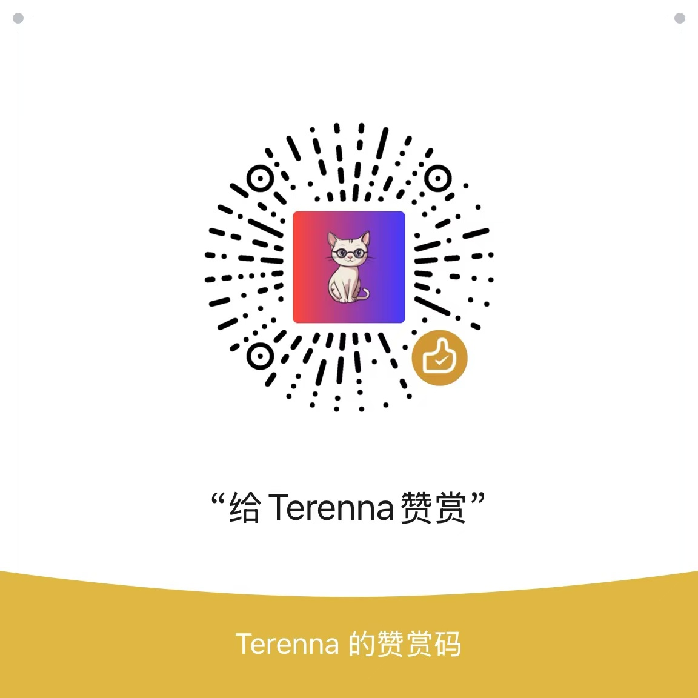

# 通用工具库 (General Tool Library)

此仓库并非独立维护分支, 生产使用时请格外注意!

## 商业授权与技术支持

请通过下方二维码与我联系

    
    

## CAS (computer-aided system)

- [x] Shell 执行(Execute)
- [x] Shell 隐藏执行(ExecuteHIDE)
- [x] 带输出的执行(ExecuteWithOutput)
- [x] 获取短路径名(GetShortPathName)

## NEMU (网易 MuMu 模拟器)

当前仅支持 网易 MuMu 模拟器 12.0 版本, 即 DisplayVersion 4.1 +

- [x] 模拟器外部磁盘清理(DiskClear)
- [x] 查询单个模拟器状态信息(GetDeviceStatus)
- [x] 查询所有模拟器状态信息(GetDevicesStatus)
- [x] 创建一个新的模拟器(CreateDevice)
- [x] 批量创建模拟器(CreateDevices)
- [x] 复制模拟器(CopyDevice)
- [x] 批量复制模拟器(CopyDevices)
- [x] 删除模拟器(DeleteDevice)
- [x] 重命名模拟器(RenameDevice)
- [x] 启动指定模拟器(StartDeviceByIndex)
- [x] 启动所有模拟器(StartAllDevices)
- [x] 停止指定模拟器(StopDeviceByIndex)
- [x] 停止所有模拟器(StopAllDevices)
- [x] 重启指定模拟器(RestartDeviceByIndex)
- [x] 模拟器窗口排版(ArrangeDevices)
- [x] 启动模拟器里的应用(StartApp)
- [x] 在所有模拟器上启动应用(StartAppOnAllDevices)
- [x] 停止模拟器里的应用(StopApp)
- [x] 在所有模拟器上停止应用(StopAppOnAllDevices)
- [x] 指定模拟器上查询应用信息(GetAppInfo)
- [x] 模拟器屏幕旋转(RotateScreen)
- [x] 模拟器返回主页(BackToHome)
- [x] 模拟器返回操作(GoBack)
- [x] 模拟器摇一摇(Shake)

## sqlhandler (Gorm SQL 帮助库)

- [x] SQL 文件模板执行(LoadSQLTemplate)

## License

Copyright 2024 tianxidev, All rights reserved.

Licensed under the Apache License, Version 2.0 (the "License");
you may not use this file except in compliance with the License.
You may obtain a copy of the License at

    http://www.apache.org/licenses/LICENSE-2.0

Unless required by applicable law or agreed to in writing, software
distributed under the License is distributed on an "AS IS" BASIS,
WITHOUT WARRANTIES OR CONDITIONS OF ANY KIND, either express or implied.
See the License for the specific language governing permissions and
limitations under the License.
